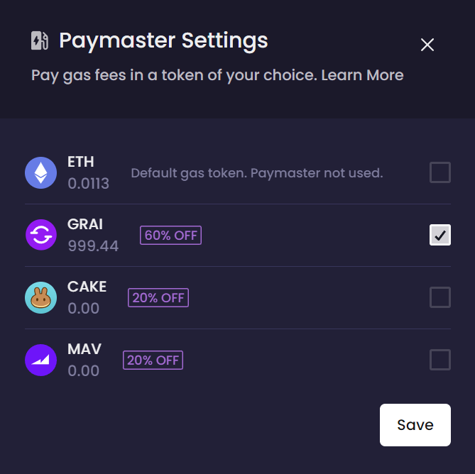

# Paymaster on zkSync

### Using GRAI for Gas Fees on Gravita Protocol

Gravita and many of its partners now allow you to select GRAI and many other ERC-20 tokens as your payment option for gas fees. \
\
With the Paymaster Settings, you can opt to pay your transaction costs with GRAI or other ERC-20 tokens, potentially at a discounted rate, as illustrated in the platform interface. \
\
As of March 2024, you will receive the zkSync gas refund in the same token that you chose to pay the gas fee in. This integration offers a significant improvement in convenience, allowing you to utilize your GRAI holdings directly for transaction costs, and simplifying the process of interacting with Gravita Protocol.

<figure><figcaption>
Use GRAI instead of ETH to pay for gas fees on zkSync
</figcaption></figure>

To set up your Paymaster preferences:

1. Select Gravita's zkSync deployment.
2. Go to the Paymaster Settings in your Gravita account dashboard, on the top right of your screen.
3. Select GRAI or another token as your preferred token for paying gas fees. Some tokens are **sponsoring their usage as gas tokens** as shown in the Settings. This means that your effective cost for gas will be much lower than if you use ETH.
4. Confirm your selection and enjoy seamless transactions with your chosen ERC-20 token.

The integration of Zyfi's Paymaster is a significant milestone for Gravita Protocol, further aligning with our mission to provide an accessible, user-friendly platform that supports the seamless use of censorship-resistant tokens across the DeFi landscape.

### Problem with Gas

Traditional transactions on blockchain networks require users to pay gas fees in the native token of the network, which can be inconvenient, especially for new users unfamiliar with acquiring and managing these tokens. This requirement often results in confusion, delays, and a fragmented user experience as funds are spread across different wallets.

### Smart Wallets Drawbacks

Although Smart Wallets offer a partial solution by allowing transactions to be signed off by a smart contract, enabling interactions with a separate UserOp Mempool for gasless transactions, they come with their own set of challenges:

1. They necessitate gas for deployment, incurring additional costs for the user or the application.
2. They are often specific to the app they are designed for, lacking interoperability with other dApps.
3. Users generally find traditional externally owned accounts (EOAs) easier and more familiar to use.

### zkSync's Native Account Abstraction

zkSync stands out by being the first EVM-compatible Layer 2 solution to integrate AA at the core protocol level. This allows users to initiate transactions gaslessly through common wallets like MetaMask, TrustWallet, and others. Accounts in zkSync can act like EOAs but also include arbitrary logic akin to smart contracts, thus offering the best of both worlds.
